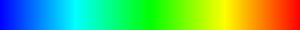
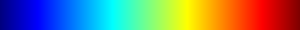
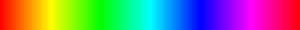

# Tinycolormap .NET

Color map library for scientific visualizations. This library is a .NET port of [tinycolormap](https://github.com/yuki-koyama/tinycolormap).

## Available Colormaps

### Matlab

| Name     | Sample                         |
|:--------:|:------------------------------:|
| Parula   |    |
| Heat     |      |
| Hot      |       |
| Jet      |       |
| Gray     |      |
| HSV      |      |

Reference: <https://www.mathworks.com/help/matlab/ref/colormap.html>

The HSV colormap is cyclic and is particularly useful for plotting angles or phases because the color transition from 1 to 0 is smooth. A phase wrap would thus not appear as a sharp edge.

### Matplotlib

| Name     | Sample                         |
|:--------:|:------------------------------:|
| Magma    |     |
| Inferno  |   |
| Plasma   |    |
| Viridis  |   |
| Cividis  |   |

These colormaps are designed to be perceptually uniform (even in black-and-white printing) and friendly to colorblindness. Cividis is specially designed such that it enables as identical interpretation to both those without a CVD and those with red-green colorblindness as possible.

Magma, Inferno, Plasma, Viridis are released under CC0 by Nathaniel J. Smith, Stefan van der Walt, and (in the case of Viridis) Eric Firing: <https://github.com/BIDS/colormap/blob/master/colormaps.py>. Their python code is adapted for the use in C#.

Cividis is released under CC0 by the authors of PLOS ONE paper (Jamie R. Nuñez, Christopher R. Anderton, Ryan S. Renslow): <https://doi.org/10.1371/journal.pone.0199239>. We incorporated the LUT into C#.

### GitHub

| Name     | Sample                         |
|:--------:|:------------------------------:|
| Github   |    |

This colormap is designed to mimic the color scheme used in GitHub contributions visualization.

### Other

| Name     | Sample                         |
|:--------:|:------------------------------:|
| Turbo    |     |

Turbo is developed as an alternative to the Jet colormap by Anton Mikhailov (Google LLC). See [the blog post](https://ai.googleblog.com/2019/08/turbo-improved-rainbow-colormap-for.html) for the details. [The original lookup table](https://gist.github.com/mikhailov-work/6a308c20e494d9e0ccc29036b28faa7a) is released under the Apache 2.0 license. We merged it and re-licensed the part under the MIT license for consistency.

| Name      | Sample                          |
|:---------:|:-------------------------------:|
| Cubehelix |  |

Cubehelix is developed by Dr. Dave Green and is designed for astronomical intensity images. It shows a continuous increase in perceived intensity when shown in color or greyscale. This implementation uses Green's "default" scheme (start: 0.5, rotations: -1.5, hue: 1.0, gamma: 1.0). See [the original publication](https://ui.adsabs.harvard.edu/abs/2011BASI...39..289G/abstract) for details.
